# Cheropatilla http server

This repo contains the implementation of the http server for the Cheropatilla website.

### Installation

1. run `go get github.com/luisguve/cherosite` and `go get github.com/luisguve/cheroapi`. Then run `go install github.com/luisguve/cherosite/cmd/cherosite` and `go install github.com/luisguve/cheroapi/cmd/...`. The following binaries will be installed in your $GOBIN: `cherosite`, `userapi`, `general` and `contents`. On setup, all of these must be running.
1. You will need to write a .toml file in order to configure the site to get it working. See cherosite.toml at the project root for an example.
1. Follow the installation instructions for the gRPC services in the [cheroapi project](https://github.com/luisguve/cheroapi#Installation).

To run the web application, run `cherosite`, `userapi`, `general` and `contents`, then visit **localhost:8000** from your browser, create a couple users and start following users, creating posts, replying posts and saving/unsaving them.

### Application overview

##### Root: "/"

**If you're not logged in**, the login/signin page is rendered. You can create an account with an email, name, patillavatar, username, alias (if blank, name is used as alias), description and password. Email and username must be unique; username is alphanumeric and underscores are allowed.

*Note:* patillavatar (profile pic) is optional; if you don't send a picture, it picks a random one from the default pics specified in the field patillavatars in the toml file.

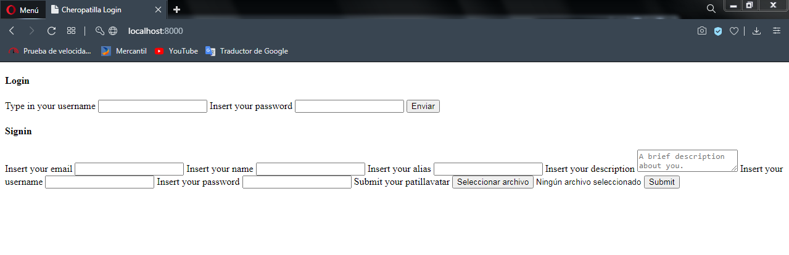

**When you're logged in**, the dashboard page is rendered. Here you can see the recent activity of the users you're following, your own recent activity and the posts you've saved. All of these contents are loaded in a **random fashion**.

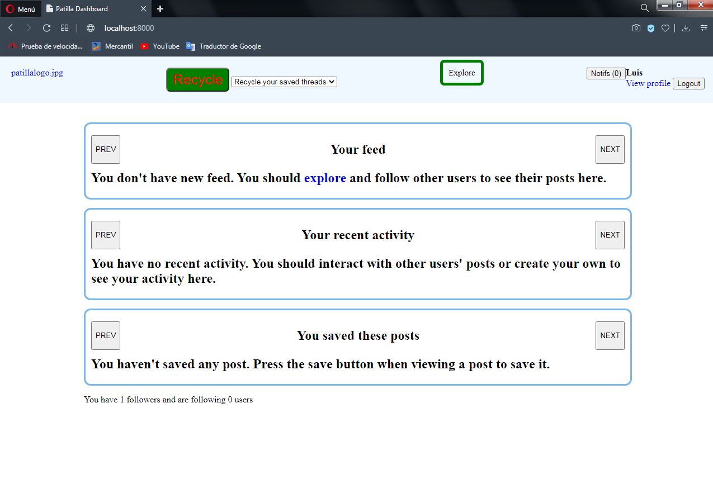

##### Navigation bar

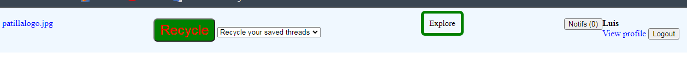

A couple of buttons are displayed in this area:

1. A link to the root, where the website logo is supposed to be.
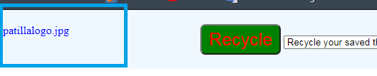
1. A ***Recycle*** button. This button is the **main feature** of the whole website. The idea is that when you press it, it loads more contents in a **random fashion**, depending upon the select input aside it, and builds ***local pages*** from these contents. The navigation across these local pages will be done through **PREV** and **NEXT** buttons.
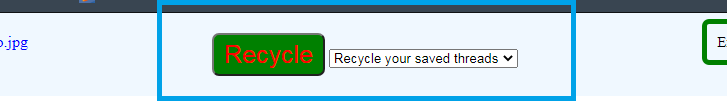
1. A link to */explore*.
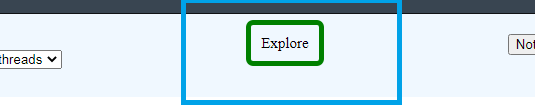
1. Your notifications, a link to your profile page and a button to logout.

##### Explore page: "/explore"

This page displays posts from every section registered in the `sections` array in the .toml file in a random fashion.

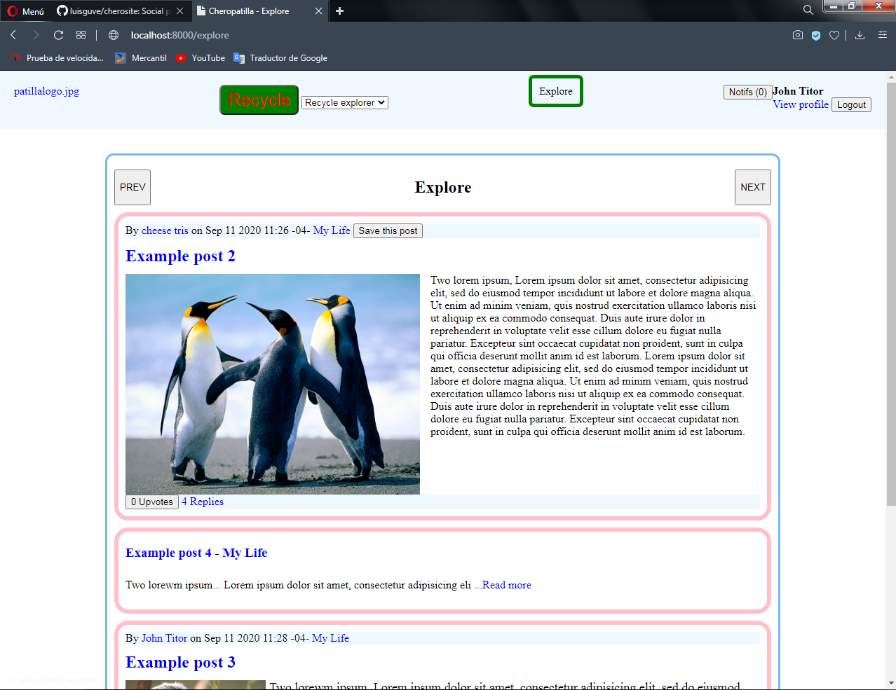

##### My profile page: "/myprofile"

In this page, you can view and update your basic information.

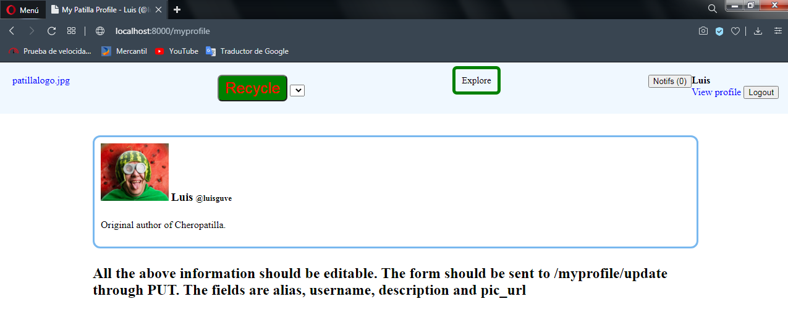

##### Other users' profile page: "/profile?username={username}"

In this page, you can view the basic information of othe user, along with the recent activity for that user.

##### Section page: "/{section_id}"

This page displays posts from a given section and a form to create a post on that section. The section id must match the id of one of the sections specified in the `sections` array in the .toml file.

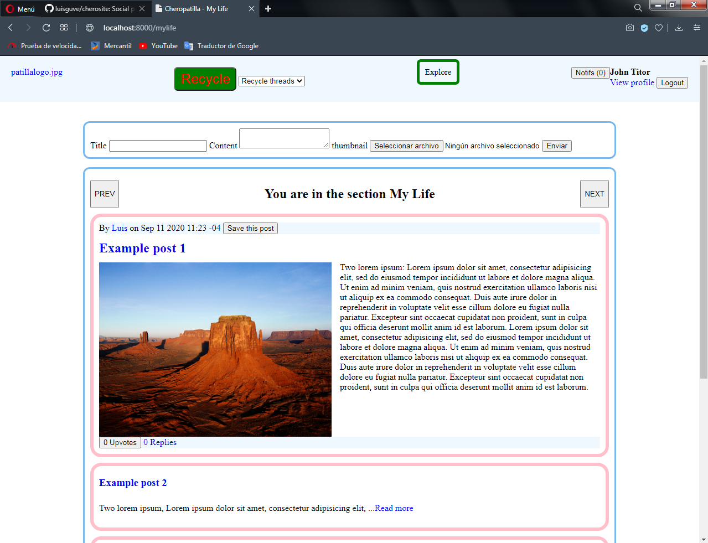

##### Post page: "/{section_id}/{post_id}"

This page displays the content of a given post and the comments associated to that post, at the bottom. Note that the comments are also loaded in a **random fashion**.

You can also reply other comments, but these are loaded sequentially in chronological order.

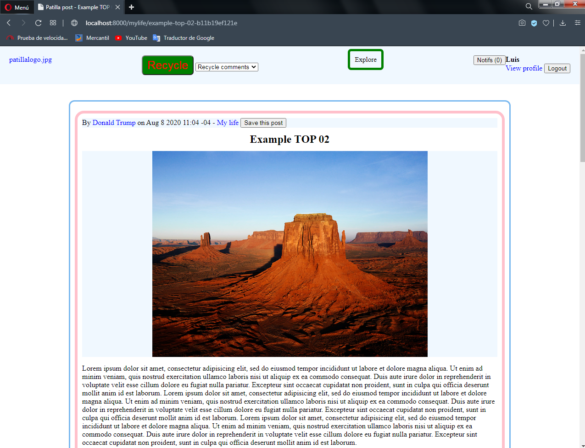

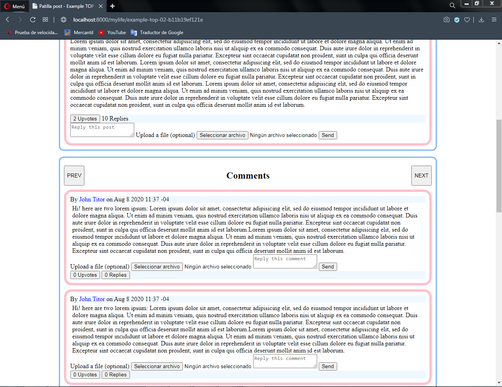

### Application API

Note: all the endpoints for pagination will return, on success, either contents in html format or an empty string.

##### Pagination of dashboard content

To get more contents from the recent activity of the users following, the endpoint **"/recyclefeed"** receives GET requests with **Header "X-Requested-With" set to "XMLHttpRequest"**.

To get more contents from the recent activity of the user logged in, the endpoint **"/recycleactivty"** receives GET requests with **Header "X-Requested-With" set to "XMLHttpRequest"**.

To get more saved posts of the user logged in, the endpoint **"/recyclesaved"** receives GET requests with **Header "X-Requested-With" set to "XMLHttpRequest"**.

##### Pagination of posts in Explore

To get more contents from every section, the endpoint **"/explore/recycle"** receives GET requests with **Header "X-Requested-With" set to "XMLHttpRequest"**.

##### Pagination of posts in a section

To get more contents from a given section, the endpoint **"/{section_id}/recycle"** receives GET requests with **Header "X-Requested-With" set to "XMLHttpRequest"**.

##### Pagination of comments in a post

To get more comments from a given post, the endpoint **"/{section_id}/{post_id}/recycle"** receives GET requests with **Header "X-Requested-With" set to "XMLHttpRequest"**.

##### Pagination of activity in a profile page

To get more posts, comments and subcomments from a given user, the endpoint **"/profile/recycle?userid={user_id}"** receives GET requests with **Header "X-Requested-With" set to "XMLHttpRequest"**.

Note that it requires the user id rather than the username.

##### Follow/unfollow

To follow a user, the endpoint **"/follow?username={username}"** receives POST requests. Similarly, the endpoint **"/unfollow?username={username}"** receives POST requests to unfollow a user.

A user cannot follow/unfollow itself.

##### Update user data

For this purpose, the endpoint **"/myprofile/update"** receives POST requests with the following form data:

- alias: text
- username: text
- description: text
- pic_url: file - jpg, png or gif

##### Reply a post

The endpoint **"/{section_id}/{post_id}/comment"** will receive POST requests with the following form data:

- content: string
- ft_file: file - jpg, png or gif

Similarly, to reply a comment, the endpont **"/{section_id}/{post_id}/comment?c_id={comment id}"** will receive POST requests with the same form data.

##### Notifications

- Notifications are sent to users as events happens through a **websocket** on **"/livenotifs"**.
- Notifications are cleaned up through GET requests with **Header "X-Requested-With" set to "XMLHttpRequest"** to:
 - **"/readnotifs"** to mark all the unread notifications as read.
 - **"/clearnotifs"** to delete both read and unread notifications.

The following events will be notified:

- A user (not you) upvotes your post. Only you will be notified.
- A user (not you) upvotes your comment. The post author and you will be notified.
- A user (not you) upvotes your subcomment. The post author and you will be notified.
- A user (not you) leaves a reply on your post. Only you will be notified.
- A user (not you) leaves a reply on your comment. The post author, the comment author and all the users who replied the same comment will be notified.
